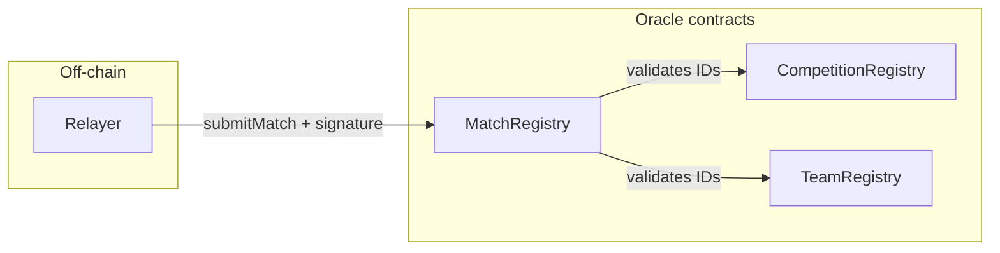

# Oracle - Sports Pulse

On-chain contracts that validate EIP-712 signatures and store football match results (competitions, teams, and match scores).

## Overview

The oracle is the final component in the Sports Pulse pipeline:

**Provider → Signer → Relayer → Oracle**

It consists of three smart contracts: **CompetitionRegistry**, **TeamRegistry**, and **MatchRegistry**. The relayer calls `submitMatch` on MatchRegistry for each signed match; the contract accepts the submission only when the payload is signed by the authorized signer and passes all validations (matchId derivation, competition and team IDs, score bounds, and match date).

## Contracts


| Contract                | Source                                                     | Role                                                                                                                                                                                                                                                                     |
| ----------------------- | ---------------------------------------------------------- | ------------------------------------------------------------------------------------------------------------------------------------------------------------------------------------------------------------------------------------------------------------------------ |
| **CompetitionRegistry** | [src/CompetitionRegistry.sol](src/CompetitionRegistry.sol) | Maps `competitionId` to competition name. Owner-only `addCompetition`; constructor takes a `string[]` from deployment data (max 200 per batch).                                                                                                                          |
| **TeamRegistry**        | [src/TeamRegistry.sol](src/TeamRegistry.sol)               | Maps `teamId` to team name. Owner-only `addTeams`; same batch pattern (max 200 per batch).                                                                                                                                                                               |
| **MatchRegistry**       | [src/MatchRegistry.sol](src/MatchRegistry.sol)             | EIP-712 + Ownable. Stores `Match(matchId, homeTeamScore, awayTeamScore)`. Validates matchId derivation, competition/team existence in the other registries, score bounds (≤80), and the EIP-712 signature. Owner can `rotateSigner` (previous signers cannot be reused). |


MatchRegistry depends on the addresses of CompetitionRegistry and TeamRegistry at deployment time; it uses them only for validation (no funds or custody).

## Match identity and EIP-712

- **matchId** = `keccak256(abi.encodePacked(competitionId, homeTeamId, awayTeamId, matchDate))`, with `matchDate` as YYYYMMDD (UTC).
- **EIP-712 domain:** name `SportsPulse`, version `1`. Struct: `Match(bytes32 matchId, uint8 homeScore, uint8 awayScore)`.

The signer and relayer use the same canonical matchId and EIP-712 domain so that the relayer’s `submitMatch` payload matches what the signer signed. See the [signer](../signer/README.md) and [relayer](../relayer/README.md) READMEs for their configuration.

## Development

### Project layout


| Path                  | Purpose                                                                                                         |
| --------------------- | --------------------------------------------------------------------------------------------------------------- |
| `src/`                | Solidity contracts (CompetitionRegistry, TeamRegistry, MatchRegistry).                                          |
| `script/Deploy.s.sol` | Foundry script to deploy the whole project; reads `script/data/competitions.json` and `script/data/teams.json`. |
| `script/data/`        | Initial competition and team names for deployment.                                                              |
| `test/`               | Forge tests (e.g. MatchRegistry.t.sol, CompetitionRegistry.t.sol, TeamRegistry.t.sol, Deploy.t.sol).            |


### Build and test

From the `oracle/` directory:

```bash
make test
# or
forge test
```

### Static analysis

From the **repository root**, run Slither via Docker Compose (uses [slither.config.json](slither.config.json), which excludes `lib/`):

```bash
docker compose run --rm slither
```

## Deployment

Deployment is done with the Foundry script. It requires three distinct addresses: **deployer** (pays gas), **authorized signer** (address used by MatchRegistry to verify EIP-712 signatures), and **contracts owner** (receives ownership of all three contracts after deployment). Ownership is transferred to `CONTRACTS_OWNER_ADDRESS` in the same script. Initial competition and team data are read from `script/data/competitions.json` and `script/data/teams.json`.

**Full step-by-step instructions** (faucets, RPC, `.env`, `foundry.toml`, dry-run, broadcast, verification, Safe wallet): see the **[Sepolia deployment guide](sepolia-deployment-guide.md)**.

### Environment variables (deploy)


| Variable                    | Purpose                                                                                    |
| --------------------------- | ------------------------------------------------------------------------------------------ |
| `DEPLOYER_PRIVATE_KEY`      | EOA that signs deployment transactions; must hold ETH on the target chain.                 |
| `AUTHORIZED_SIGNER_ADDRESS` | Address that will be set as MatchRegistry’s `authorizedSigner`.                            |
| `CONTRACTS_OWNER_ADDRESS`   | Address that will receive ownership of all three contracts.                                |
| `RPC_URL`                   | RPC endpoint for the target chain (e.g. Sepolia). Used by `foundry.toml` and the Makefile. |
| `ETHERSCAN_API_KEY`         | For contract verification on Etherscan.                                                    |


If you use the Sepolia guide’s `.env` example with `SEPOLIA_RPC_URL`, set `RPC_URL` to the same value (or export `RPC_URL=$SEPOLIA_RPC_URL`) when running the script.

### Quick deploy (Makefile)

With `.env` loaded (or the variables set in the environment):

```bash
source .env
make deploy RPC_URL=$RPC_URL
```

The Makefile runs `forge script` with `--broadcast` and `--verify`. For a dry-run only, use `forge script script/Deploy.s.sol:Deploy --rpc-url <your-rpc>` without `--broadcast`.

## Integration (for other services)

- **Relayer** and **Signer** need the **MatchRegistry** contract address as `ORACLE_CONTRACT_ADDRESS`, and the same `CHAIN_ID` as the deployed chain. The signer’s private key must correspond to MatchRegistry’s `authorizedSigner`.
- Current Sepolia deployment addresses are listed in the root [README.md](../README.md).

## Security and audit

- **Primary:** [audit/SECURITY_AUDIT_SOLODIT_AI.md](audit/SECURITY_AUDIT_SOLODIT_AI.md) - AI-generated Solodit-based audit covering the contracts and the deployment script. It includes status per finding (Not vulnerable / Mitigated / Recommendation), a comparison summary, and operational recommendations (EIP-712 domain alignment, signer/owner separation, key security, deployment env).

Signer rotation is owner-only, and previous signers cannot be reused (`signersHistory`). For a general checklist, see [Solodit](https://solodit.cyfrin.io/checklist).

## Architecture




