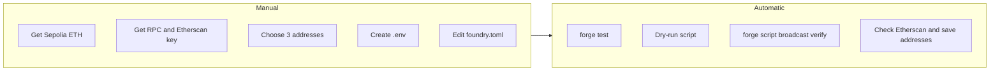

# Sepolia Deployment Guide (Foundry)

A step-by-step guide for deploying the Sports Pulse Oracle (Foundry) to the Sepolia testnet.

---

## Step 1: Get Sepolia ETH

You need testnet ETH to pay for gas. Grab some from one of these faucets:

- **Alchemy Faucet**: https://sepoliafaucet.com
- **Google Faucet**: https://cloud.google.com/application/web3/faucet/ethereum/sepolia
- **Infura Faucet**: https://www.infura.io/faucet/sepolia

> Most faucets require a small mainnet balance or a Google/Alchemy account to prevent abuse.

---

## Step 2: Get an RPC URL and Etherscan API Key

You need an RPC endpoint to communicate with the Sepolia network:

- **Alchemy** (https://alchemy.com) — create a free app, select "Ethereum Sepolia", copy your HTTPS URL
- **Infura** (https://infura.io) — same process
- **Public endpoint**: `https://rpc.sepolia.org` — works but less reliable

For contract verification you also need an **Etherscan API key**: create a free account at https://etherscan.io and get your API key from the account settings.

---

## Step 3: Choose Three Distinct Addresses

The deploy script expects three different addresses (all must be distinct from each other):

| Variable | Role |
|----------|------|
| **Deployer** | EOA that signs the deployment transactions; must hold Sepolia ETH. |
| **Authorized signer** | Address used by `MatchRegistry` to sign match results; cannot be zero. |
| **Contracts owner** | Receives ownership of `CompetitionRegistry`, `TeamRegistry`, and `MatchRegistry` after deployment. Can be a Safe (multisig) for production-like setups. |

The script will revert if deployer equals authorized signer, deployer equals contracts owner, or authorized signer equals contracts owner.

---

## Step 4: Set Up Your `.env`

Create a `.env` file in the project root (oracle folder) with:

```env
SEPOLIA_RPC_URL=https://eth-sepolia.g.alchemy.com/v2/YOUR_KEY
DEPLOYER_PRIVATE_KEY=0xYOUR_DEPLOYER_PRIVATE_KEY
AUTHORIZED_SIGNER_ADDRESS=0xYourAuthorizedSignerAddress
CONTRACTS_OWNER_ADDRESS=0xYourContractsOwnerAddress
ETHERSCAN_API_KEY=YOUR_ETHERSCAN_KEY
```

> ⚠️ **Never commit your private key.** Ensure `.env` is in your `.gitignore` (it already is in this project). Use a dedicated deployer wallet — not your main wallet.

The deploy script reads `DEPLOYER_PRIVATE_KEY`, `AUTHORIZED_SIGNER_ADDRESS`, and `CONTRACTS_OWNER_ADDRESS` from the environment; it does not accept the private key via CLI. Foundry loads `.env` automatically when you run `forge script`.

---

## Step 5: Configure `foundry.toml`

Add a Sepolia RPC alias and Etherscan config so Foundry can reference them by name. Add this to your existing `foundry.toml`:

```toml
[rpc_endpoints]
sepolia = "${SEPOLIA_RPC_URL}"

[etherscan]
sepolia = { key = "${ETHERSCAN_API_KEY}" }
```

---

## Step 6: Pre-deploy Checks (Recommended)

**Run tests:**

```bash
make test
# or: forge test
```

**Dry-run the deploy (no broadcast, no gas spent):**

```bash
source .env
forge script script/Deploy.s.sol:Deploy --rpc-url sepolia
```

This ensures the script runs, reads `script/data/competitions.json` and `script/data/teams.json` correctly, and that your env vars are set. Use `--slow` for a more realistic simulation if you like.

---

## Step 7: Deploy

Load your environment variables and run the deploy script. The script deploys three contracts in order (`CompetitionRegistry`, `TeamRegistry`, `MatchRegistry`), transfers ownership of each to `CONTRACTS_OWNER_ADDRESS`, and reads initial data from `script/data/competitions.json` and `script/data/teams.json`.

**Option A — Using forge directly (recommended for first-time deploy with verification):**

```bash
source .env
forge script script/Deploy.s.sol:Deploy \
  --rpc-url sepolia \
  --broadcast \
  --verify
```

Foundry loads `.env` and the script reads `DEPLOYER_PRIVATE_KEY`, `AUTHORIZED_SIGNER_ADDRESS`, and `CONTRACTS_OWNER_ADDRESS` from the environment. Do **not** pass `--private-key`; the script uses `vm.envUint("DEPLOYER_PRIVATE_KEY")`.

**Option B — Using the Makefile:**

```bash
source .env
make deploy RPC_URL=$SEPOLIA_RPC_URL
```

The Makefile does not add `--verify`. If you use this option, run verification separately (see Step 8, Option B).

---

## Step 8: Verify Your Contracts on Etherscan

Contract verification publishes your source code on Etherscan, making it readable and trustworthy.

### Option A: Verify during deployment (recommended)

Use the command in Step 7 Option A with `--verify`. Foundry will use the broadcast artifacts (written to `broadcast/Deploy.s.sol/11155111/`) to verify each deployed contract. This is the easiest path.

### Option B: Verify after deployment

If you did not use `--verify` or automatic verification failed, use `forge verify-contract` for each contract.

**MatchRegistry** (constructor: `address authorizedSigner`, `CompetitionRegistry`, `TeamRegistry`):

```bash
forge verify-contract \
  <MATCH_REGISTRY_ADDRESS> \
  src/MatchRegistry.sol:MatchRegistry \
  --chain sepolia \
  --etherscan-api-key $ETHERSCAN_API_KEY \
  --constructor-args $(cast abi-encode "constructor(address,address,address)" $AUTHORIZED_SIGNER_ADDRESS $COMPETITION_REGISTRY_ADDRESS $TEAM_REGISTRY_ADDRESS)
```

**CompetitionRegistry** and **TeamRegistry** take `string[]` in the constructor. The exact encoding must match what was deployed (from `script/data/competitions.json` and `script/data/teams.json`). Encoding `string[]` via `cast abi-encode` is error-prone; the most reliable approach is to use the same build and, if needed, the constructor arguments from the broadcast run JSON in `broadcast/Deploy.s.sol/11155111/`. Alternatively, you can try:

```bash
# CompetitionRegistry — example for current data (single "LaLiga")
forge verify-contract \
  <COMPETITION_REGISTRY_ADDRESS> \
  src/CompetitionRegistry.sol:CompetitionRegistry \
  --chain sepolia \
  --etherscan-api-key $ETHERSCAN_API_KEY \
  --constructor-args $(cast abi-encode "constructor(string[])" "[\"LaLiga\"]")

# TeamRegistry — encoding 20 team names; ensure the JSON array matches script/data/teams.json exactly
forge verify-contract \
  <TEAM_REGISTRY_ADDRESS> \
  src/TeamRegistry.sol:TeamRegistry \
  --chain sepolia \
  --etherscan-api-key $ETHERSCAN_API_KEY \
  --constructor-args $(cast abi-encode "constructor(string[])" "[...]")
```

Once verified, each contract source will be visible at:
`https://sepolia.etherscan.io/address/<CONTRACT_ADDRESS>#code`

---

## Step 9: Confirm the Deployment

- Visit **https://sepolia.etherscan.io** and search your deployer address.
- You should see the deployment transactions and the three contract creation txs.
- Deployed addresses are also in `broadcast/Deploy.s.sol/11155111/run-latest.json` (or the latest run file).
- For each contract, if verified, the **Contract** tab will show the source code with a green checkmark.
- Save the three contract addresses (CompetitionRegistry, TeamRegistry, MatchRegistry) for your frontend, backend, or documentation.

---

## What is Safe Wallet? (And When to Use It)

**Safe** (formerly Gnosis Safe) is a multisig smart contract wallet. Rather than a single private key controlling your contracts, it requires M-of-N signatures — for example, 2 out of 3 team members must approve before any transaction executes.

### How it fits into this project

The deploy script **already transfers ownership** of all three contracts to `CONTRACTS_OWNER_ADDRESS`. So you do not need a separate post-deploy transfer step: set `CONTRACTS_OWNER_ADDRESS` in `.env` to your Safe address before deploying, and the Safe will own the contracts as soon as the script completes.

### Should you use it?

| Scenario | Recommendation |
|----------|----------------|
| Solo developer, learning/testing | Plain EOA is fine |
| Simulating a real production setup | Set up a Safe on Sepolia and use it as `CONTRACTS_OWNER_ADDRESS` |
| Team project | Strongly recommended |
| Contracts have `owner`, are upgradeable, or have admin functions | Strongly recommended |

You can create a Safe on Sepolia at **https://app.safe.global** — it works exactly the same as mainnet.

---

## Deployment Flow (Manual vs Automatic)



---

## Deployment Checklist

- [ ] Sepolia ETH in deployer wallet
- [ ] RPC URL obtained (e.g. Alchemy or Infura)
- [ ] Etherscan API key obtained
- [ ] `.env` created with: `SEPOLIA_RPC_URL`, `DEPLOYER_PRIVATE_KEY`, `AUTHORIZED_SIGNER_ADDRESS`, `CONTRACTS_OWNER_ADDRESS`, `ETHERSCAN_API_KEY`
- [ ] `.env` is in `.gitignore` (already done in this repo)
- [ ] `foundry.toml` has `[rpc_endpoints]` and `[etherscan]` for Sepolia
- [ ] Deployer, authorized signer, and contracts owner are three distinct addresses
- [ ] `forge test` passes
- [ ] Dry-run succeeds: `forge script script/Deploy.s.sol:Deploy --rpc-url sepolia`
- [ ] Deploy with `--broadcast` (and optionally `--verify`) succeeds
- [ ] All three contracts (CompetitionRegistry, TeamRegistry, MatchRegistry) visible on Sepolia Etherscan
- [ ] All three contracts verified (source code with green checkmark)
- [ ] Deployment addresses saved for downstream use
