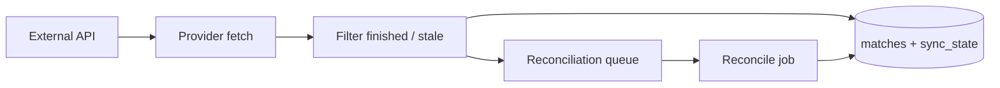

# Provider — Sports Pulse

Fetches football match data from third-party APIs (which right now is only FootballData - https://football-data.org), syncs only finished matches into the shared database, and handles stale or in-progress matches via a reconciliation queue.

## Overview

The provider is the first component in the Sports Pulse pipeline:

**Provider → Signer → Relayer → Oracle**

It writes match data to PostgreSQL; other services (e.g. the signer) read from the same database.

## Usage

The binary supports two modes.

### Sync

```text
./provider <provider> <competition>
```

Example:

```bash
./provider football_org la_liga
```

- Syncs one UTC day of matches (00:00–23:59).
- Only matches with status **FINISHED**  are persisted.
- Tracks last synced date per (competition, provider) and advances day-by-day until today.
- Matches that are not finished and started more than 6 hours ago are moved to the reconciliation queue instead of being re-synced repeatedly.

### Reconcile

```text
./provider --reconcile
```

- Processes the reconciliation queue in batches (10 items, 2-minute timeout).
- Waits 7 seconds between API requests to respect rate limits.
- For each entry, fetches the match by ID; when status is finished, saves it and removes the entry from the queue.

## Supported providers and competitions

| Provider      | Competitions (football_org) | Notes |
| ------------- | --------------------------- | ----- |
| **football_org** | La Liga (ID 2014)           | football-data.org API. Premier League is accepted by the CLI but not yet mapped for this provider. |

API statuses **FINISHED** and **AWARDED** are both treated as finished and stored.

## Configuration

Environment variables (wired by the root [docker-compose.yaml](../docker-compose.yaml) for the `provider` service):

| Variable | Purpose |
| -------- | ------- |
| `DB_HOST`, `DB_PORT`, `DB_USER`, `DB_PASSWORD` | PostgreSQL connection (database name is fixed: `sports_pulse`). |
| `FOOTBALL_ORG_API_KEY` | Required for the football_org provider. |
| `FOOTBALL_ORG_API_ENDPOINT` | Optional; override API base URL (e.g. for tests). |

## How to run

All steps are from the **repository root**, using Docker and the root [docker-compose.yaml](../docker-compose.yaml).

1. Start the container by running
   ```bash
   docker compose up -d provider
   ```
2. Connect to the container (or run the commands from your host):
   ```bash
   go run ./cmd/provider football_org la_liga
   go run ./cmd/provider --reconcile
   ```

The default `provider` service command in compose is `air` for dev hot-reload.

**Tests:** inside the provider container:

```bash
make test
make check   # golangci-lint
```

## Architecture



- **Sync flow:** Day-based sync (UTC), sync state per (competition, provider). Only finished matches are saved; matches that are not finished and started more than 6 hours ago are enqueued for reconciliation.
- **Reconciliation:** The reconcile job fetches by ID, saves the match when status is finished, then removes the entry (with batching and throttling) If the match is not finished, we retry a maximum of 5 times. After those retries, the match is kept there but not retried.
- **Match identity:** The canonical match ID is derived from competition, home/away team IDs, and match date (Keccak256), so it is consistent across providers and with the signer/oracle.

## Project layout

| Path | Purpose |
| ---- | ------- |
| `cmd/provider` | CLI entrypoint. |
| `internal/config` | Database initialization. |
| `internal/entity` | Match, Competition, Provider, Team. |
| `internal/football_org` | football_org provider (fetch, save, mappings). |
| `internal/repository` | Match, SyncState, Reconciliation. |
| `internal/service` | Sync and Reconcile logic. |
| `testutil` | Test helpers (DB, HTTP server). |
