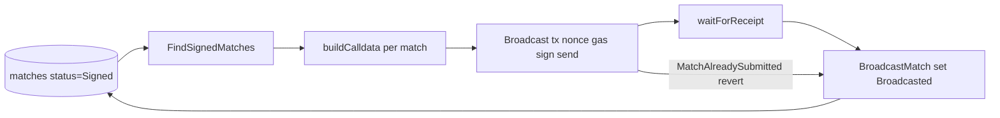

# Relayer — Sports Pulse

Submits signed football match results to the Oracle contract on-chain by broadcasting `submitMatch` transactions and updating match status to **Broadcasted**.

## Overview

The relayer is the third component in the Sports Pulse pipeline:

**Provider → Signer → Relayer → Oracle**

It reads match data from the same PostgreSQL database as the provider and signer, selects matches with status **Signed**, calls the Oracle contract’s `submitMatch` for each, waits for the transaction receipt, and sets status to **Broadcasted** so matches are not retried.

## Usage

The binary takes no CLI arguments. One run processes one batch: find all signed matches, broadcast each in order, and update status to **Broadcasted** on success (or when the contract reverts with `MatchAlreadySubmitted`).

- Typical use: run on a schedule (e.g. cron) or trigger from the host or container.
- The default `relayer` service command in compose is `air` for dev hot-reload. For a single batch run, override with the built binary or `go run ./cmd/relayer`.

### Why sequential (no goroutines)

Each process uses a single private key for broadcasting. Ethereum nonces are incremental and must be unique per account, so transaction N+1 must be broadcast after transaction N. The relayer therefore sends transactions one-by-one. If multiple keys are needed in the future, you can run multiple instances of the binary (one per key) or extend the code to support multiple keys.

## Exit codes

| Code | Meaning |
| ---- | ------- |
| `0` | Success. |
| `1` | Database initialization failed. |
| `2` | Missing or invalid environment variables. |
| `3` | Build config failed (e.g. invalid chain ID, RPC dial error). |
| `4` | Failed to find signed matches (database query error). |
| `5` | At least one broadcast failed (other matches may have been broadcast). |

When the contract reverts with `MatchAlreadySubmitted(bytes32)`, the relayer treats it as success: the match status is set to **Broadcasted** and the run continues. Only real broadcast or receipt failures increment the failure count and lead to exit code `5`.

## Configuration

Environment variables (wired by the root [docker-compose.yaml](../docker-compose.yaml) for the `relayer` service):

| Variable | Purpose |
| -------- | ------- |
| `DB_HOST`, `DB_PORT`, `DB_USER`, `DB_PASSWORD` | PostgreSQL connection (database name is fixed: `sports_pulse`). |
| `RPC_URL` | Ethereum RPC URL for the chain (e.g. `http://oracle:8545` for local). |
| `ORACLE_CONTRACT_ADDRESS` | Oracle / MatchRegistry contract address to call `submitMatch`. |
| `RELAYER_PRIVATE_KEY` | Hex-encoded ECDSA private key (32 bytes; optional `0x` prefix). Must be secp256k1 for Ethereum. |
| `CHAIN_ID` | Chain ID for transaction signing (e.g. `31337` for local). |

See the root [.env.example](../.env.example) for a template.

## How to run

All steps are from the **repository root**, using Docker and the root [docker-compose.yaml](../docker-compose.yaml).

1. Start the container (and postgres if needed):
   ```bash
   docker compose up -d relayer
   ```
2. To run a single batch instead of the default `air` command:
   ```bash
   docker compose run --rm relayer go run ./cmd/relayer
   ```
   Or build and run the binary (e.g. `./tmp/main` after a build).

**Tests:** inside the relayer container or from `relayer/` on the host:

```bash
make test
make check   # golangci-lint
```

## Architecture



- **Batch flow:** Connect to DB, find all rows with `status = Signed`, then for each match build `submitMatch(matchId, competitionId, homeTeamId, awayTeamId, homeTeamScore, awayTeamScore, matchDate, signature)` calldata, sign and send the transaction, wait for the receipt, and update the row to `status = Broadcasted`.
- **MatchAlreadySubmitted:** If the contract reverts with `MatchAlreadySubmitted(bytes32)`, the relayer detects it, updates the match to **Broadcasted**, and continues so the match is not retried.
- **Gas:** Gas is estimated per transaction; on estimation failure a fallback limit (~130k) is used. A small buffer (2%) is added to the estimated gas.
- **Sequential nonces:** Transactions are sent one after another so the relayer’s account nonce stays correct.

## Project layout

| Path | Purpose |
| ---- | ------- |
| `cmd/relayer` | CLI entrypoint (batch job, no subcommands). |
| `internal/config` | Environment (RPC, contract, key, chain ID) and database initialization. |
| `internal/entity` | Match, status constants (Signed, Broadcasted). |
| `internal/repository` | FindSignedMatches, BroadcastMatch. |
| `internal/service` | BroadcastMatches, BuildBroadcasterConfig, buildCalldata, broadcast, waitForReceipt, MatchAlreadySubmitted handling. |
| `testutil` | Test helpers (DB, mock chain client). |
