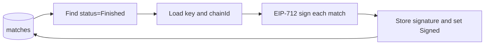

# Signer — Sports Pulse

Signs finished football match results with EIP-712 (matchId, homeScore, awayScore) for on-chain verification by the Oracle contract.

## Overview

The signer is the second component in the Sports Pulse pipeline:

**Provider → Signer → Relayer → Oracle**

It reads match data from the same PostgreSQL database as the provider, selects matches with status **Finished**, signs each with EIP-712, and writes the signature back while setting status to **Signed** so the relayer can pick them up.

## Usage

The binary takes no CLI arguments. One run processes one batch: find all finished matches, sign each, store the signature and set status to **Signed**.

- Typical use: run on a schedule (e.g. cron) or trigger from the host or container.
- The default `signer` service command in compose is `air` for dev hot-reload. For a single batch run, override with the built binary or `go run ./cmd/signer`.

## Exit codes

| Code | Meaning |
| ---- | ------- |
| `0` | Success. |
| `1` | Database initialization failed. |
| `2` | Database query failed (e.g. find matches to sign). |
| `3` | Private key load failed (invalid or missing `SIGNER_PRIVATE_KEY`). |
| `4` | Chain ID invalid or missing. |

Per-match failures (sign or store) are logged and the process continues; the exit code remains `0` unless a global step failed. A match that failed to store remains **Finished** and can be retried on a later run.

## EIP-712 and behavior

- **Domain:** name `SportsPulse`, version `1`, `chainId` and `verifyingContract` from environment (`CHAIN_ID`, `ORACLE_CONTRACT_ADDRESS`).
- **Struct:** `Match(matchId bytes32, homeScore uint8, awayScore uint8)`. The signed message matches what the Oracle contract expects.
- **Match identity:** `matchId` is the `canonical_id` from the database, consistent with the provider and oracle (competition, home/away team IDs, match date, Keccak256).
- Recovery ID is adjusted to 27 or 28 for Ethereum (see `internal/service/sign_match.go`).

## Configuration

Environment variables (wired by the root [docker-compose.yaml](../docker-compose.yaml) for the `signer` service):

| Variable | Purpose |
| -------- | ------- |
| `DB_HOST`, `DB_PORT`, `DB_USER`, `DB_PASSWORD` | PostgreSQL connection (database name is fixed: `sports_pulse`). |
| `SIGNER_PRIVATE_KEY` | Hex-encoded ECDSA private key (32 bytes; optional `0x` prefix). Must be secp256k1 for Ethereum. |
| `CHAIN_ID` | Chain ID for the EIP-712 domain (e.g. `31337` for local). |
| `ORACLE_CONTRACT_ADDRESS` | Verifying contract address for the EIP-712 domain. |

## How to run

All steps are from the **repository root**, using Docker and the root [docker-compose.yaml](../docker-compose.yaml).

1. Start the container (and postgres if needed):
   ```bash
   docker compose up -d signer
   ```
2. To run a single batch instead of the default `air` command:
   ```bash
   docker compose run --rm signer go run ./cmd/signer
   ```
   Or build and run the binary (e.g. `./tmp/main` after a build).

**Tests:** inside the signer container:

```bash
make test
make check   # golangci-lint
```

## Architecture



- **Batch flow:** Connect to DB, find all rows with `status = Finished`, load private key and chain ID from env, then for each match compute the EIP-712 hash, sign it, and update the row with the signature and `status = Signed`.
- **Errors:** If signing or storing fails for a match, the error is logged and the loop continues. That match stays **Finished** and will be retried on the next run.

## Project layout

| Path | Purpose |
| ---- | ------- |
| `cmd/signer` | CLI entrypoint (batch job, no subcommands). |
| `internal/config` | Database initialization. |
| `internal/entity` | Match, MatchStatus. |
| `internal/repository` | FindMatchesToSign, StoreSignature. |
| `internal/service` | SignMatch, LoadPrivateKey, LoadChainId. |
| `testutil` | Test helpers (DB, logger). |
